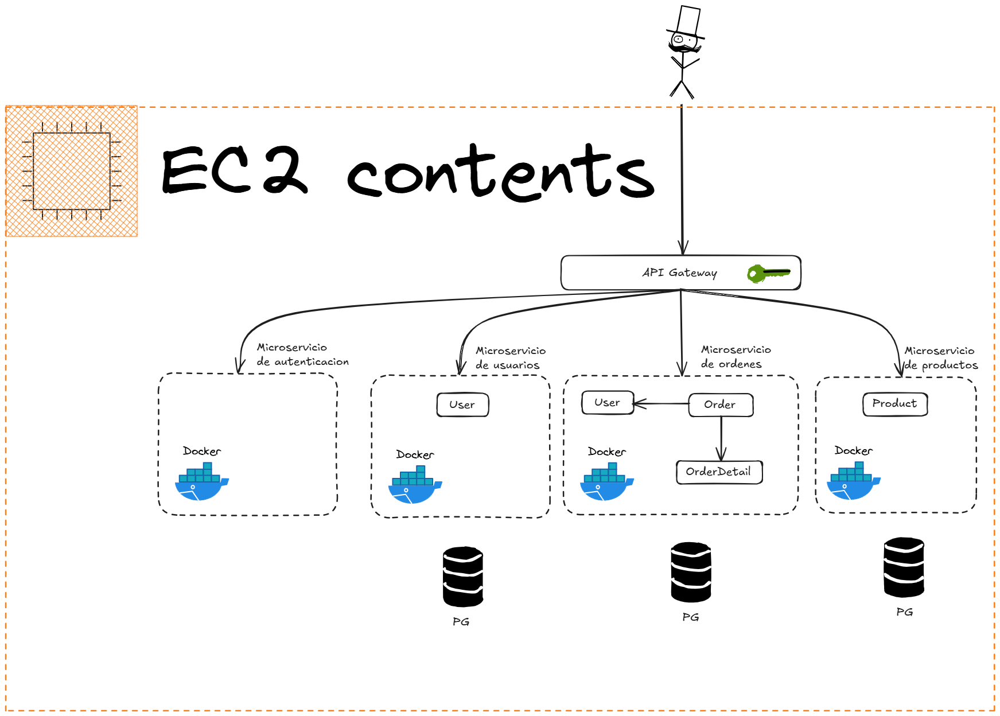
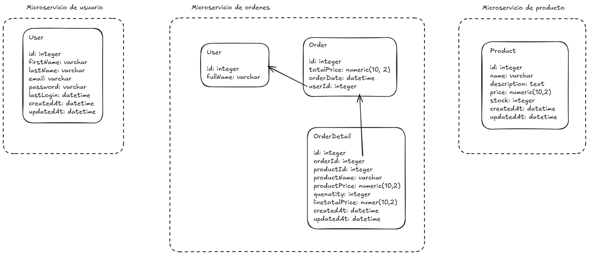

# Technical Test Solution for Salva Health

## Architecture Overview

Below is a diagram explaining the proposed architecture:



In the architecture above, three microservices were built to host the business logic:

- **product-service**: Handles product-related operations.
- **users-service**: Manages user-related data and operations.
- **orders-service**: Responsible for processing orders.

Each microservice has its own dedicated database, which will be explained later. There is a clear separation of contexts where user data is duplicated within the orders microservice. This ensures higher availability: if the users-service goes down, the orders-service can continue functioning independently.

A fourth microservice, **api-gateway**, was implemented to receive all incoming requests and route them to the appropriate microservices. This way, only the API Gateway is exposed to the client, keeping the microservices hidden from direct access.

Additionally, a fifth microservice, **auth-service**, was created to handle authentication. While authentication is integrated within the API Gateway, the auth-service is responsible for exposing authentication endpoints for login and registration.

## Database Design

The database design for each microservice is as follows:



## Microservices Structure

Each microservice follows a similar directory structure:

```
microservice-name/
├── src/
│   ├── controller/
│   ├── dto/
│   ├── entity/
│   ├── error/
│   ├── middleware/
│   ├── repository/
│   ├── routes/
│   ├── schemas/
│   ├── service/
│   ├── data-source.ts
│   ├── index.ts
```

## Installation

### 1. Clone the repository

```sh
git clone <repository-url>
cd <repository-folder>
```

### 2. Start the system with Docker

Run the following command to set up all the containers:

```sh
docker compose up -d
```

### 3. Seed the database

In the users-service and product-service, you can run the following command to create sample records in the database:

```sh
docker compose exec <service-name> npm run seed

docker compose exec user-service npm run seed
docker compose exec product-service npm run seed
```

## Notes

Docker is configured to expose the API Gateway on port 3001. By navigating to .../api-docs, you will find the Swagger documentation for all the endpoints exposed to the client. (Not all created endpoints are listed. Some are used internally, such as user creation or stock reduction)
